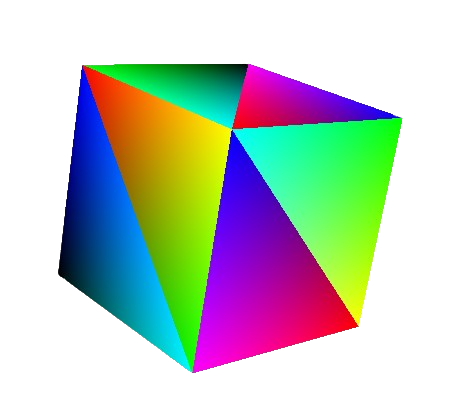

<h1>RGB Cube Project</h1>

  

This project was developed as part of the Graphic Computing class. It demonstrates the creation of an RGB cube, with each face of the cube having two colors. The project uses OpenGL for rendering.

<h2>Features</h2>
<ul>
  <li>3D rendering of a cube.</li>
  <li>Each face of the cube is colored with two different colors.</li>
  <li>Basic interaction and visualization using OpenGL.</li>
</ul>

<h2>Dependencies</h2>

To build and run this project, you will need the following dependencies:

<ul>
  <li>g++</li>
  <li>OpenGL</li>
  <li>GLEW</li>
  <li>GLFW</li>
  <li>GLM</li>
</ul>

<h2>Installation</h2>

<h3>Ubuntu/Debian-based Systems</h3>
<ol>
  <li><strong>Install system dependencies:</strong>
    <pre><code>sudo apt-get update
sudo apt-get install g++ libglu1-mesa-dev freeglut3-dev mesa-common-dev libglew-dev libglfw3-dev libglm-dev
    </code></pre>
  </li>
  <li><strong>Clone the repository:</strong>
    <pre><code>git clone https://github.com/your-username/rgb-cube.git
cd rgb-cube
    </code></pre>
  </li>
  <li><strong>Build the project:</strong>
    <pre><code>make
    </code></pre>
  </li>
  <li><strong>Run the executable:</strong>
    <pre><code>./build/objects/src/geometry_object
    </code></pre>
  </li>
</ol>

<h2>File Structure</h2>
<ul>
  <li><code>src/</code>: Contains the source code.</li>
  <li><code>include/</code>: Contains the header files.</li>
  <li><code>build/</code>: Contains the compiled objects and executable.</li>
  <li><code>Makefile</code>: Build script to compile the project.</li>
</ul>

<h2>Usage</h2>

Run the executable to view the RGB cube. You can interact with the cube using basic keyboard and mouse inputs, if implemented.

<h2>Commands</h2>

<h3>Keyboard Commands:</h3>
<ul>
  <li><strong>W:</strong> moves cube up</li>
  <li><strong>S:</strong> moves cube down</li>
  <li><strong>A:</strong> moves cube left</li>
  <li><strong>D:</strong> moves cube right</li>
  <li><strong>F:</strong> moves cube forward</li>
  <li><strong>B:</strong> moves cube backward</li>
</ul>

<h3>Mouse Commands:</h3>

Press and hold left button to move the cube.

<h2>Development</h2>

<h2>License</h2>

This project is licensed under the MIT License - see the <a href="LICENSE">LICENSE</a> file for details.

